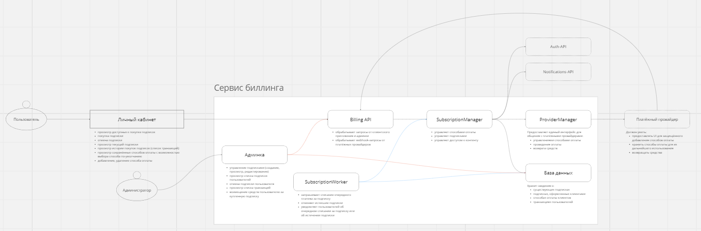

# Сервис биллинга
Репозиторий с исходным кодом: https://github.com/dcomrad/graduate_work/  
Проект запущен по адресу: http://51.250.6.208:5005/  


# Приложения
* admin-panel - панель администратора (Django)
* backend - API сервиса (FastAPI)
* worker - воркер, отслеживающий окончание подписок (Python)

# Запуск
* скопировать infra/env.example => infra/env
* заполнить все переменные окружения
* список команд:
```
make up             - запуск сервиса
make down           - остановка сервиса
make down-volumes   - остановка сервиса с удалением всех данных
```

Архитектура проекта


